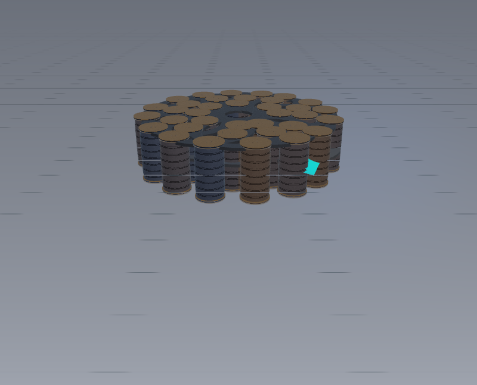
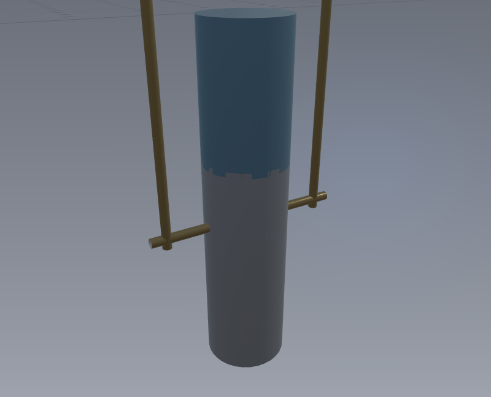
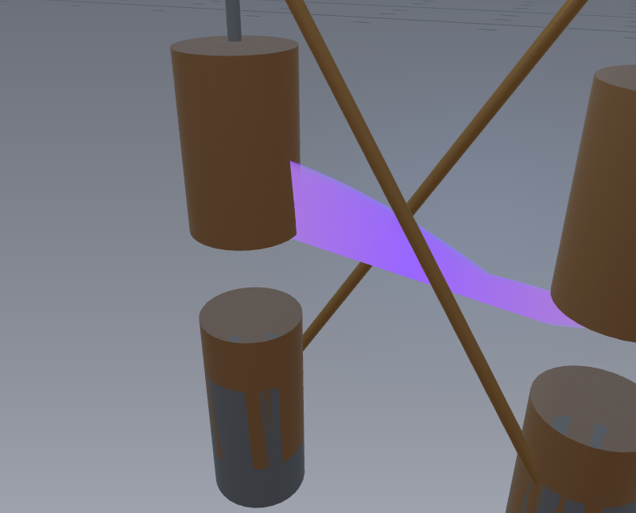
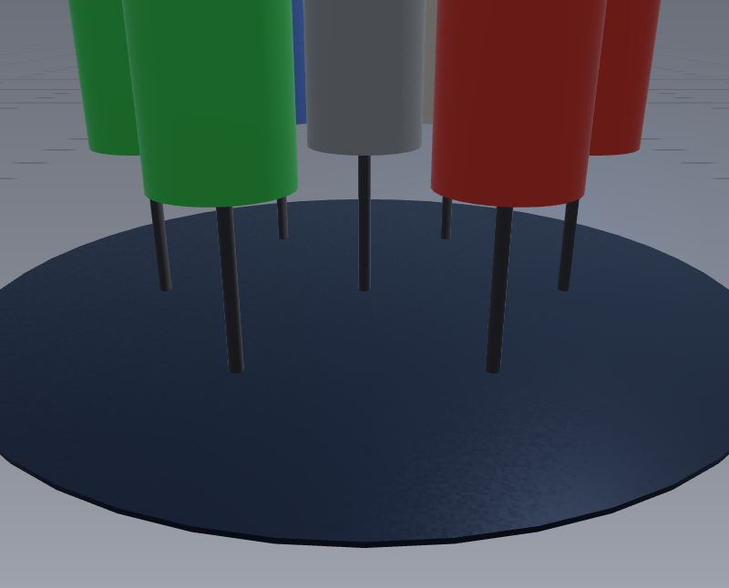
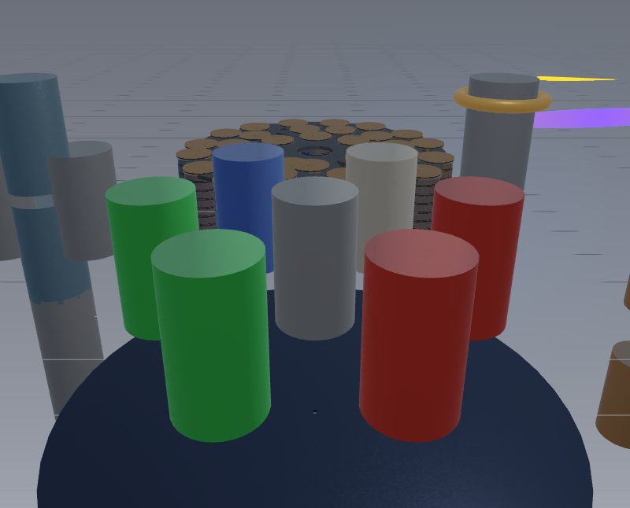

# SEG WebGPU Visualizer

Real-time WebGPU simulation of the Searl Effect Generator (SEG) with extensible architecture for Heron's Fountain and Kelvin's Thunderstorm.

**Live Demo:** https://ford442.github.io/power_gen/

> **Note:** The old URL `https://ford442.github.io/seg-webgpu-visualizer/` now redirects here (see [ford442/seg-webgpu-visualizer](https://github.com/ford442/seg-webgpu-visualizer)).

WebGL2 fallback (no WebGPU required): [open with `?renderer=webgl2`](https://ford442.github.io/power_gen/?renderer=webgl2)

## Preview

| SEG | Heron's Fountain | Kelvin's Thunderstorm | LEDs + Solar |
|-----|------------------|----------------------|--------------|
|  |  |  |  |

**Multi-device overview** (all devices + energy pipes):



*Screenshots use the WebGL2 fallback (`?renderer=webgl2`) for broad browser compatibility.*

## Features
- Three concentric rings of instanced magnetic rollers in toroidal formation
- 10,000-50,000 GPU particles driven by **stateful kinematic integration** (persistent
  per-particle position + velocity in a storage buffer, advanced each frame by real forces)
- Four physically-modelled modes:
  - **SEG** — roller spin-up from moment of inertia, Lorentz drive torque and Lenz
    eddy-current braking to a self-regulating terminal velocity (with coronal glow)
  - **Heron's Fountain** — Bernoulli exit velocity with Swamee–Jain pipe friction and
    depleting head pressure; droplets bunch realistically at the apex
  - **Kelvin's Thunderstorm** — charged droplets under gravity + Stokes drag + Coulomb
    repulsion, capacitive voltage runaway, electrostatic levitation, and a fractal
    (midpoint-displacement) discharge at dielectric breakdown
  - **LEDs + Solar** — photons reflected/absorbed by Snell + Fresnel optics on silicon
- Interactive orbital camera (drag to rotate, scroll to zoom)

## Future Plans
- **Quanta Magnetics catalog** — plugin-registered research apparatuses (first: [Magnetic Levitation](docs/DEVICE_GALLERY.md#maglev)); more candidates: homopolar generator, Halbach field visualizer, pulse-coil educational demo
- Hardware bridge hooks for Quanta product twins when specs are available

**SEG Explainer** (shipped): [guided tour](docs/SEG_EXPLAINER.md), B-field experiments, shareable `#lab=` URLs, classroom mode — sidebar **SEG Learning**.

See the [Device Gallery](docs/DEVICE_GALLERY.md) for screenshots and literature links.

## Browser Support
- **WebGPU (default):** Chrome/Edge 113+ with WebGPU enabled. Requires HTTPS or localhost.
- **WebGL2 fallback:** Any browser with WebGL2 — for debugging, CI, and agent-driven visual testing when WebGPU is unavailable or hard to automate.

## WebGL2 Fallback Renderer

A toggleable WebGL2 path renders the same multi-device scene (SEG rollers, particles, sky/grid) using shared simulation state. Use it for Playwright screenshots, geometry/material iteration, and porting features to WebGPU.

### Enable WebGL2 mode

| Method | Example |
|--------|---------|
| URL parameter | `?renderer=webgl2` |
| Browser console | `setRenderer('webgl2')` then reload |
| localStorage | `localStorage.setItem('seg-renderer', 'webgl2')` |
| Global (dev) | `window.DEBUG_RENDERER = 'webgl2'` before load |

Switch back: `?renderer=webgpu` or `setRenderer('webgpu')`.

### Debug keys (WebGL2 only)

| Key | Action |
|-----|--------|
| `W` | Wireframe overlay |
| `P` | Cycle particle debug (glow → ID/phase → velocity heat) |
| `N` | Normal debug coloring |
| `Space` | Pause / resume simulation |
| `.` | Single simulation step |
| `[` / `]` | Slow-motion factor |

### Agent / CI hooks

```js
window.currentRenderer          // 'webgpu' | 'webgl2'
document.querySelector('#gpuCanvas').dataset.renderer
// WebGL2:
window.captureCanvasFrame({ flipY: true })  // RGBA pixels + view
window.getRendererInfo()        // fps, view, telemetry snapshot, intentionalGaps
window.setMode('seg')           // focus device (both renderers)
// START via UI or: window.segOperator.start()
```

WebGL2 parity notes: [`docs/WEBGL2.md`](docs/WEBGL2.md).
## Architecture

Single client-side app under `src/` (Vite root). No dual legacy tree.

| Path | Module | Backend |
|------|--------|---------|
| Primary | `MultiDeviceVisualizer` | WebGPU |
| Fallback | `WebGL2MultiDeviceVisualizer` | WebGL2 (`?renderer=webgl2`) |

`src/main.js` is bootstrap + window API only. Shared CPU physics/geometry lives in
`src/renderers/shared/`. Agent/dev details: [`docs/AGENTS.md`](docs/AGENTS.md).
WebGPU adapter/device setup: [`docs/WEBGPU.md`](docs/WEBGPU.md).

## Local Development
```bash
npm install
npm run typecheck   # TypeScript physics/integration layer
npm run validate    # typecheck + native C++ smoke + WGSL (naga optional)
npm run dev
# WebGL2: http://localhost:5173/?renderer=webgl2
# WebGPU: http://localhost:5173/
```

### Build scripts

| Command | When to use |
|---------|-------------|
| `npm run build:site` | **Default** — Vite → `dist/` using committed WASM under `src/public/wasm/` |
| `npm run build` | Full rebuild: recompile WASM (needs `emcc`) then site |
| `npm run wasm:build` | WASM only via `scripts/build-wasm.sh` (`emcc` on PATH or `EMSDK=...`) |
| `npm run wasm:native` | C++ smoke test (g++, no Emscripten) |
| `npm run check:wgsl` | Offline WGSL check with `naga` if installed |

Vite toolchain packages (`esbuild`, `rollup`, …) come **transitively** from `vite`; they are not direct dependencies.

## Deployment (GitHub Pages)

The live demo is deployed automatically on every push to `main` via [`.github/workflows/static.yml`](.github/workflows/static.yml):

1. `npm ci`, `npm run typecheck`, `npm run build:site` (Vite → `dist/`)
2. GitHub Actions uploads `dist/` and publishes to Pages

Non-deploy validation (typecheck, native C++, WGSL) runs on PRs via
[`.github/workflows/validate.yml`](.github/workflows/validate.yml).
**Demo URL:** https://ford442.github.io/power_gen/ (repo name is `power_gen`; the old `seg-webgpu-visualizer` path no longer applies.)

**One-time setup** (already done for this repo): In GitHub → Settings → Pages, set **Source** to **GitHub Actions**. The workflow uses `configure-pages` with `enablement: true` so future clones can enable Pages from CI.

**Manual redeploy:** Actions → “Deploy static content to Pages” → Run workflow.

### Optional Contabo deploy

For the separate `storage.1ink.us` host, build then run `deploy.py` with a token from the environment (never commit tokens):

```bash
npm run build:site
export DEPLOY_TOKEN="your_token_from_vps"
python deploy.py
```