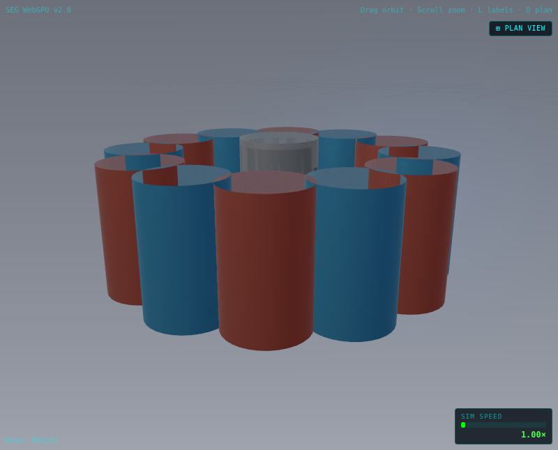
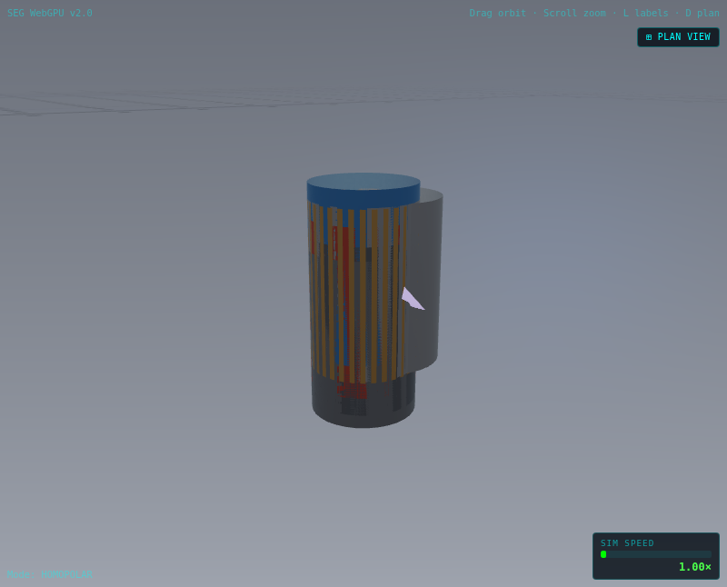
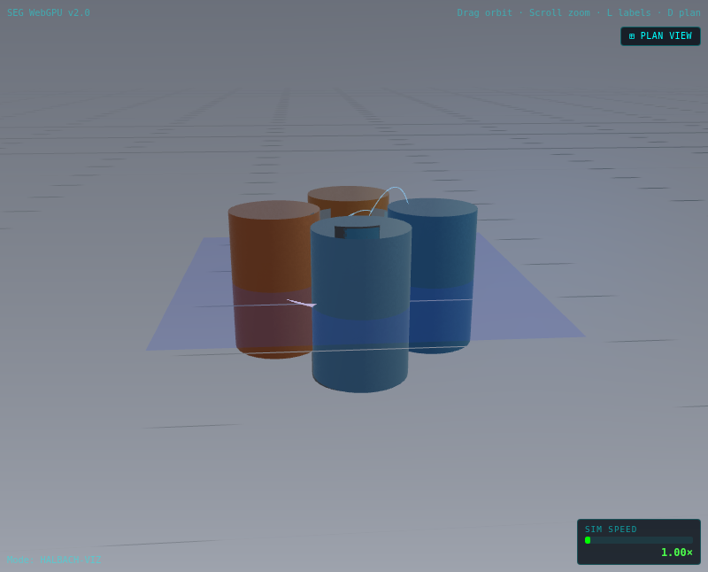
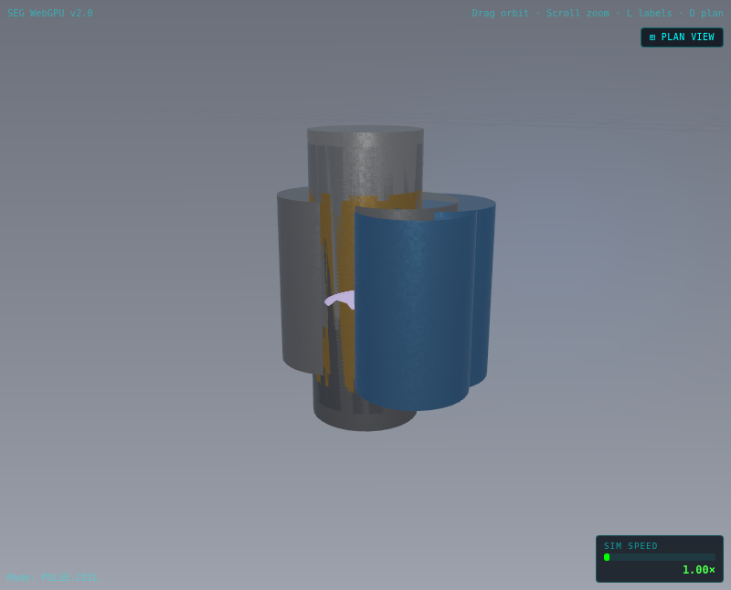
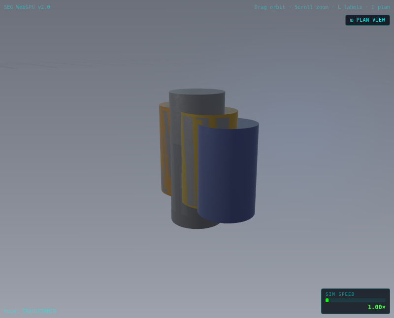
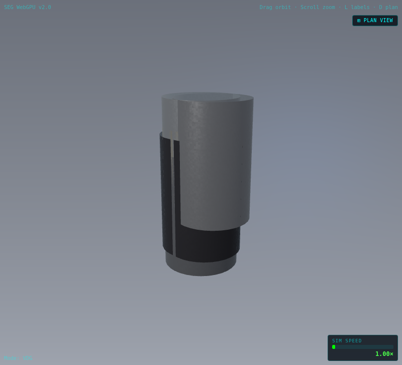
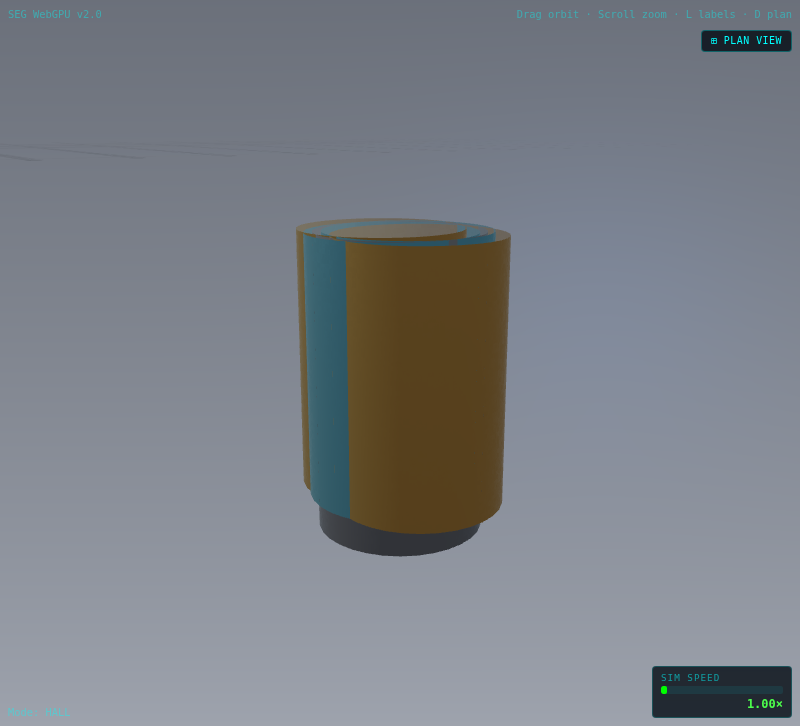
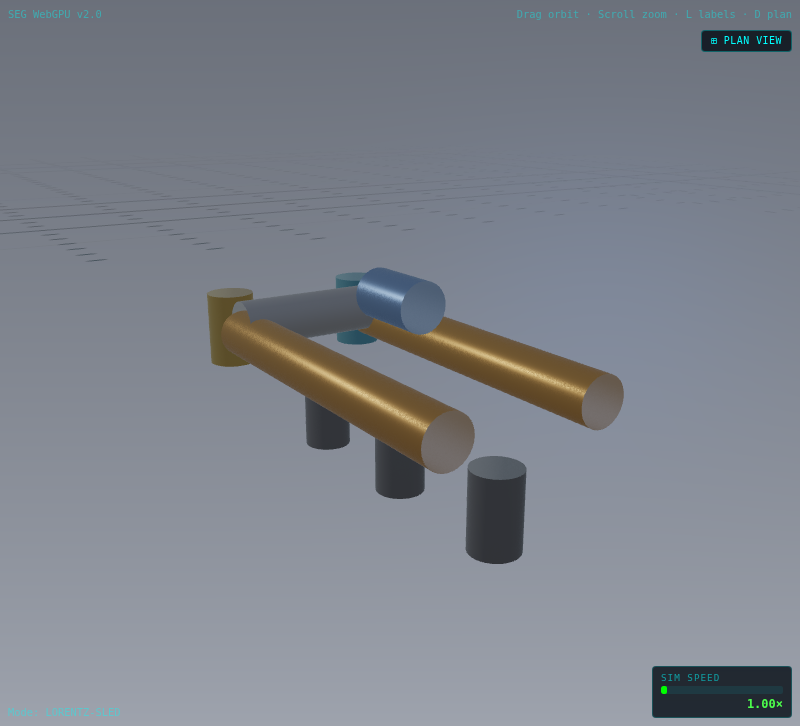

# Device Gallery

Catalog of multi-device lab apparatuses. Screenshots use the WebGL2 fallback
(`?renderer=webgl2`) for broad browser compatibility; capture via:

> **`shaderMode` vs `wasmMode`:** plugin `modeIndex` is the WGSL/uniform
> namespace (`shaderMode` in [`physics/devices.json`](../physics/devices.json)).
> It is **not** the C++ `SimMode`. See generated [`MODE_MATRIX.md`](./MODE_MATRIX.md).
> Homopolar shader **8** / wasm **7** is intentional. Add devices via the catalog
> first; do not invent a fourth magic number.

```js
// After START (non-zero drive) and a short settle:
window.setMode('maglev');
await window.captureCanvasFrame({ flipY: true });
// Save PNG under docs/images/<device>-focus.png (agent / CI path)
```

**Screenshot path convention:** `docs/images/<device-id>-focus.png` (and
optional `docs/images/<device-id>-overview.png`). Regenerated on Cloud VMs with
`?renderer=webgl2` because headless agents have no WebGPU adapter.

## Plugin registration

New devices register through `src/devices/device-registry.ts` without editing
`MultiDeviceVisualizer`:

```js
import { registerDevice } from '../device-registry';
import { catalogIdentity, NEXT_SHADER_MODE } from '../../generated/device-catalog';

registerDevice({
  ...catalogIdentity('my-device'), // after adding the row to physics/devices.json
  meshLayout: { cylinders: () => [...] },
  stepPhysics(state, dt, drive) { /* ... */ },
  createPhysicsState() { return { /* ... */ }; },
  telemetrySchema: { fieldT: { label: 'B-field', unit: 'T' } },
  references: [{ title: '...', authors: '...', year: 1980 }]
});
// Next unused shaderMode (do not reuse retired slots): NEXT_SHADER_MODE
```
```

Import side-effect bundle: `src/devices/register-plugins.ts` (loaded from `main.ts`).

Overview positions for plugin devices without an explicit `position` are assigned
by `src/devices/layout-packer.ts` on an outer ring (radius 20 m).

---

## maglev

**Magnetic Levitation** — Quanta Magnetics research demo: Halbach-style ring
magnets lift a conductive floater; simplified spring–damper gap dynamics with
eddy-current damping metaphor.

| View | Screenshot |
|------|------------|
| Overview | See [`images/multi-device.png`](images/multi-device.png) |
| Focus |  |

Capture: `?renderer=webgl2` → START → `setMode('maglev')` → `captureCanvasFrame({ flipY: true })` → `docs/images/maglev-focus.png`.

### Telemetry

| Field | Unit | Source |
|-------|------|--------|
| Air gap | mm | Simulation (`maglevGapMm`) |
| B-field (est.) | T | `estimateHalbachFieldT()` — order-of-magnitude from B_r |
| Lift proxy | N | Spring lift model |
| Floater spin | RPM | Drive-scaled demo RPM |

### References

1. K. Halbach — *Design of permanent multipole magnets with oriented rare earth cobalt material* (1980)
2. M. V. Berry — *The levitation of spinning magnets* (1996)
3. `ValidatedConstants.MAGNET_BR` — NdFeB N52 remanence

### Implementation

- Plugin: `src/devices/quanta/magnetic-levitation.ts`
- WGSL mode index: `6` (`posMagLev` in `shaders/passes/particle-compute.wgsl`)
- WASM plant: `SimMode=6` (`?wasmPhysics=1`); JS spring–damper fallback when WASM off

---

## homopolar

**Homopolar Generator** — classic Faraday disc: rotating copper conductor in an
axial magnetic field with brushed radial current path. Educational L–R circuit
with back-EMF ε ≈ ½ B ω r² (not full 3D FEM).

| View | Screenshot |
|------|------------|
| Overview | See [`images/multi-device.png`](images/multi-device.png) |
| Focus |  |

Capture: `?renderer=webgl2` → START → `setMode('homopolar')` → `captureCanvasFrame({ flipY: true })` → `docs/images/homopolar-focus.png`.

### Telemetry

| Field | Unit | Source |
|-------|------|--------|
| Disc RPM | RPM | Simulation (`homopolarRpm`) |
| EMF (est.) | V | `estimateHomopolarEmfV()` — ½ B ω r² |
| Disc current | A | L–R brushed circuit |
| B-field (axial) | T | NdFeB pole model (`homopolarFieldT`) |

### References

1. M. Faraday — *Experimental researches in electricity* (1831)
2. J. A. Wheeler, R. P. Feynman — *The homopolar generator* (1967)
3. H. D. Algie — *Unipolar machines: steady-state and transient analysis* (1989)

### Implementation

- Plugin: `src/devices/quanta/homopolar-generator.ts`
- WGSL mode index: `8` (`posHomopolar` in `shaders/passes/particle-compute.wgsl`)
- WebGL2: instanced disc + magnet poles via `mesh-renderer.drawPluginDevice`
- WASM plant: `SimMode=7` (`?wasmPhysics=1`); JS L–R fallback when WASM off

---

## halbach-viz

**Halbach Array Field Visualizer** — standalone Quanta demo showing how oriented
magnet segments shape the B-field. Configurable N-segment ring (or linear array
via `?halbachLinear=1`); speed slider drives segment count and magnetization
angle. CPU RK4 field-line tracer with |B| slice heatmap on focus view.

| View | Screenshot |
|------|------------|
| Overview | See [`images/multi-device.png`](images/multi-device.png) |
| Focus |  |

Capture: `?renderer=webgl2` → START → `setMode('halbach-viz')` → `captureCanvasFrame({ flipY: true })` → `docs/images/halbach-viz-focus.png`.

### Telemetry

| Field | Unit | Source |
|-------|------|--------|
| Segments | — | Simulation (`halbachSegmentCount`) |
| Mag. angle | ° | Per-segment rotation (`halbachMagAngleDeg`) |
| Peak \|B\| | T | Dipole superposition grid sample |
| Period | m | Spatial Halbach repeat (`halbachPeriodM`) |
| Dipole force | N | ∇(m·B) proxy on test dipole |

### References

1. K. Halbach — *Design of permanent multipole magnets with oriented rare earth cobalt material* (1980)
2. M. V. Berry — *The levitation of spinning magnets* (1996)
3. `src/physics/magnetic-field.ts` — shared dipole + Halbach superposition library

### Implementation

- Plugin: `src/devices/quanta/halbach-viz.ts`
- Field math: `src/physics/magnetic-field.ts`, `src/devices/quanta/halbach-field.ts`
- WGSL mode index: `9` (`posHalbach` in `shaders/passes/particle-compute.wgsl`)
- WebGL2: CPU field lines + heatmap via `renderers/webgl2/halbach-field-renderer.js`
- Shareable lab link: `#lab=…;mode=halbach-viz;hseg=12` (optional `hlin=1`)
- Plant: CPU-JS only (slow path OK); C++ exposes `estimateHalbachFieldT` for offline sampling

---

## pulse-coil

**Pulse Coil (R–L)** — classroom pulsed-electromagnet demo: capacitor-bank
discharge through a series inductor; peak B from coil amp-turns; soft-iron
armature travel as an attraction proxy. **Educational L–R model only** — not a
projectile, coilgun weapons, or high-energy pulse simulation.

| View | Screenshot |
|------|------------|
| Overview | See [`images/multi-device.png`](images/multi-device.png) |
| Focus |  |

Capture: `?renderer=webgl2` → START → `setMode('pulse-coil')` → `captureCanvasFrame({ flipY: true })` → `docs/images/pulse-coil-focus.png`.

### Telemetry

| Field | Unit | Source |
|-------|------|--------|
| Coil current | A | Series R–L discharge (`pulseCoilCurrentA`) |
| Cap voltage | V | Bank state (`pulseCoilVCap`) |
| B peak (est.) | T | μ₀ N I / (2 R) classroom estimate |
| Armature travel | mm | Soft-iron pull-in proxy (`pulseCoilArmatureMm`) |

### References

1. D. J. Griffiths — *Introduction to Electrodynamics* (series R–L)
2. E. M. Purcell, D. J. Morin — *Electricity and Magnetism* (RLC / amp-turns)
3. H. C. Roters — *Electromagnetic Devices* (solenoid armature fundamentals)

### Implementation

- Plugin: `src/devices/quanta/pulse-coil.ts`
- WGSL mode index: `7` (`posPulseCoil` in `shaders/passes/particle-compute.wgsl`)
- WebGL2: coil + cap bank + armature mesh via `drawPluginDevice`; basic particles
- Plant: **JS only by design** (no WASM `SimMode`; sandboxed educational model + footer I/V oscilloscope sparkline)
- Shareable lab link: `#lab=…;mode=pulse-coil;pcap=0.75` (optional charge fraction)

### Wave slice (WebGPU, `high` tier)

In focus, a panel in front of the coil shows a **2D TM_z FDTD slice**
([ADR-0010](adr/0010-fdtd-slice.md)) of the coil's axial cross-section:

- **Drive:** six turns, each crossing the plane at ±coil radius as a J_z line
  source, ⊙ (out of the plane) on the left and ⊗ (into it) on the right.
  Amplitude follows the displayed coil current, `I / 80 A`, clamped to ±1.5.
- **Colours:** Ez warm (+) / cool (−); |H| green, which is the coil's own
  magnetic field filling the bore while current flows; a thin frame marks the
  absorbing sponge.
- **Honest scale:** normalized units, vacuum only (the iron armature is not in
  the field model), and **light slowed** so a front crosses the panel in about a
  second. A real pulse this slow radiates wavelengths far larger than the bench.
  Qualitative, not a field-strength measurement.
- **Gate:** pulse-coil focus at `high` tier; `?fdtd=0` turns it off. F3 shows
  `FDTD slice (ADR-0010)`; the footer next to the scope says why it is off.
  WebGL2 skips it.
- Code: `src/physics/fdtd-tmz.ts` (constants + CPU reference),
  `src/devices/quanta/fdtd-slice-pass.ts`, `PULSE_COIL_FDTD` in `pulse-coil.ts`.

---

## transformer

**Mutual Induction** — Quanta classroom transformer: primary drive, secondary
resistive load, coupling coefficient *k*, and an ideal-vs-leakage toggle.
Textbook two-winding model (Chapman / Fitzgerald) — **not FEM**. Both
paths run the same coupled-inductor RK4 ODE: the JS fallback is a
term-for-term port of the C++ plant (it used to be a phasor approximation,
so `?wasmPhysics=1` changed every reading).

| View | Screenshot |
|------|------------|
| Overview | See [`images/multi-device.png`](images/multi-device.png) |
| Focus |  |

Capture: `?renderer=webgl2` → START → `setMode('transformer')` →
`setTransformerLeakage(false|true)` → `captureCanvasFrame({ flipY: true })` →
`docs/images/transformer-focus.png`.

### Telemetry

| Field | Unit | Source |
|-------|------|--------|
| Primary V | V | Plant (`transformerVp`) |
| Secondary V | V | Plant (`transformerVs`) |
| Primary I | A | Plant (`transformerIpA`) |
| Secondary I | A | Plant (`transformerIsA`) |
| Coupling *k* | — | Ideal ≈ 0.97 / leakage ≈ 0.72 |
| Flux (norm) | — | Visual flux bridge cue (`transformerFluxN`) |

### References

1. S. J. Chapman — *Electric Machinery Fundamentals* (ideal transformer & coupling)
2. A. E. Fitzgerald, C. Kingsley, S. D. Umans — *Electric Machinery* (coupled-circuit equations, M = k√(Lp Ls))

### Implementation

- Plugin: `src/devices/quanta/transformer.ts` (registered via `quanta/index.ts`)
- WGSL mode index: `10` (`posTransformer` in `shaders/passes/particle-compute.wgsl`)
- WASM `SimMode`: `8` (`SIM_MODE_TRANSFORMER` from `physics/devices.json`); plugin uses `catalogIdentity('transformer')`
- UI: Mutual Induction mode button; Ideal / Leakage coupling controls;
  `window.setTransformerLeakage(bool)`
- Plant: C++ coupled-inductor RK4 ODE when `?wasmPhysics=1`; JS fallback mirrors it exactly
- Flux: WebGPU `passes/transformer-flux-compute.wgsl` (toroidal-core billboards
  in focus); WebGL2 keeps CPU flux particles

---

## vdg

**Van de Graaff Generator** — classroom electrostatic generator: an insulating
belt carries charge from a grounded lower comb to an upper comb near an
isolated metal sphere. Isolated-sphere capacitance `C = 4πε₀r`, a leakage
resistance, and a spark-gap discharge when the surface field exceeds the
classroom air-breakdown estimate (`E ≈ 3×10⁶ V/m`). **Educational model —
classroom electrostatics, not a high-voltage engineering design.**

| View | Screenshot |
|------|------------|
| Overview | See [`images/multi-device.png`](images/multi-device.png) |
| Focus |  |

Capture: `?renderer=webgl2` → START → `setMode('vdg')` → `captureCanvasFrame({ flipY: true })` → `docs/images/vdg-focus.png`.

### Telemetry

| Field | Unit | Source |
|-------|------|--------|
| Sphere voltage | V | Plant (`vdgVoltage`) |
| Belt speed | m/s | Drive-scaled belt speed (`vdgBeltMps`) |
| Sphere charge | C | Belt-charge minus leakage integral (`vdgChargeC`) |
| Spark rate | Hz | Rolling 1 s discharge-event window (`vdgSparkHz`) |

### References

1. R. J. Van de Graaff — *A 1,500,000 volt electrostatic generator* (1931)
2. D. J. Griffiths — *Introduction to Electrodynamics* (isolated-conductor capacitance, air-breakdown field)

### Implementation

- Plugin: `src/devices/quanta/van-de-graaff.ts` (registered via `quanta/index.ts`)
- WGSL mode index: `12` (`posVdg` in `shaders/passes/particle-compute.wgsl`)
- WASM `SimMode`: `9` (`SIM_MODE_VDG` from `physics/devices.json`); plugin uses `catalogIdentity('vdg')`
- UI: Van de Graaff mode button; `#lab=` guided tour (`window.startVdgTour()`)
- Plant: C++ belt-charge/leakage/spark-gap ODE when `?wasmPhysics=1`; JS fallback mirrors it exactly

---

## hall

**Hall-Effect Bench** — current-carrying conducting strip in a perpendicular
magnetic field: `V_H = I·B / (n·e·t)`, `R_H = 1/(n·e)`. A classroom toggle
switches carrier density between a semiconductor (~1e21 m⁻³, large Hall
voltage) and a metal (~1e28 m⁻³, Hall voltage nearly vanishes at the same
drive). **Educational model — not a calibrated metrology instrument.**

| View | Screenshot |
|------|------------|
| Overview | See [`images/multi-device.png`](images/multi-device.png) |
| Focus |  |

Capture: `?renderer=webgl2` → START → `setMode('hall')` →
`setHallCarrierType('semiconductor'|'metal')` → `captureCanvasFrame({ flipY: true })` →
`docs/images/hall-focus.png`.

### Telemetry

| Field | Unit | Source |
|-------|------|--------|
| Hall voltage | V | Plant (`hallVoltage`) |
| Drive current | A | Smoothed drive-scaled current (`hallCurrent`) |
| B-field | T | Drive-derived bench parameter, or the coupled Halbach estimate under `?fieldCoupling=1` (`hallFieldT`) |
| Hall coefficient | m³/C | `R_H = 1/(n·e)` for the selected carrier (`hallCoeff`) |

### References

1. E. H. Hall — *On a new action of the magnet on electric currents* (1879)
2. C. Kittel — *Introduction to Solid State Physics* (carrier density, Hall coefficient by material)

### Implementation

- Plugin: `src/devices/quanta/hall-effect.ts` (registered via `quanta/index.ts`)
- WGSL mode index: `13` (`posHall` in `shaders/passes/particle-compute.wgsl`)
- WASM `SimMode`: `10` (`SIM_MODE_HALL` from `physics/devices.json`); plugin uses `catalogIdentity('hall')`
- UI: Hall-Effect Bench mode button; Semiconductor / Metal carrier-density controls;
  `window.setHallCarrierType('semiconductor'|'metal')`
- Plant: C++ algebraic I·B→Hall-voltage model when `?wasmPhysics=1`; JS fallback mirrors it exactly
- Explainer: 6-step `#lab=` tour (`src/seg-explainer/hall-tour.json`) —
  current → field (local vs coupled) → V_H → carrier density, closing on what
  the model is not; `window.startHallTour()`
- B field is a local UI parameter **by default** (drive-derived), the isolated-classroom
  choice. **Off by default**, not unavailable: under `?fieldCoupling=1` it follows
  `halbach-viz`'s peak |B| estimate clamped to `HALL.bMaxT`, and the panel names the
  source device. Coupled or local, that B is a **simulated estimate**, never metrology —
  ADR-0011 and `docs/TELEMETRY.md`

---

## lorentz-sled

**Lorentz Rail Sled** — a sliding armature bridges two rails inside a
transverse bench field, so the drive current pushes it along the track with
`F = I ℓ × B` against friction and its own back-EMF. **Educational
Lorentz-force model — a low-voltage bench rail motor, not a railgun design
tool.** There is no projectile, no muzzle energy, and no ballistics anywhere
in the plant; the pedagogical result is the *terminal* balance where back-EMF
and friction cancel the drive.

Lumped model, per substep:

```
L dI/dt = V_drive(drive) − I·R − B·ℓ·v        back-EMF B·ℓ·v
m dv/dt = I·ℓ·B − μ·m·g·tanh(v/v_eps) − b·v   Lorentz force vs friction
dx/dt   = v                                    reported modulo rail length
```

Neither branch uses explicit Euler. `τ = L/R ≈ 100 µs` is far shorter than a
render substep, so the current is advanced with its analytic exponential
solution, and the velocity update takes both linear-in-`v` terms — viscous drag
and the back-EMF reaction `(Bℓ)²/R` — implicitly. Both are then stable at any
substep length, including a long dropped frame (asserted by the native smoke's
`dt = 1 s` case).

| View | Screenshot |
|------|------------|
| Overview | See [`images/multi-device.png`](images/multi-device.png) |
| Focus |  |

Capture: `?renderer=webgl2` → START → `setMode('lorentz-sled')` →
`setLorentzFieldT(0.8)` → `captureCanvasFrame({ flipY: true })` →
`docs/images/lorentz-sled-focus.png`.

### Telemetry

| Field | Unit | Source |
|-------|------|--------|
| Sled speed | m/s | Plant velocity state (`lorentzSledVms`) |
| Armature current | A | R–L loop current, reduced by back-EMF (`lorentzCurrentA`) |
| Field B | T | Local bench slider, or the coupled MHD channel estimate under `?fieldCoupling=1` (`lorentzFieldT`; the slider setpoint is parked in `lorentzFieldLocalT`) |
| Lorentz force | N | `F = I·ℓ·B` on the armature (`lorentzForceN`) |
| Position along rails | m | Wraps at `LORENTZ.railLengthM` (`lorentzPositionM`) |

### References

1. D. J. Griffiths — *Introduction to Electrodynamics*, ch. 5 (`F = I ∫ dl × B`)
2. D. Halliday, R. Resnick, J. Walker — *Fundamentals of Physics*, the
   conducting-rod-on-rails motional-EMF problem this plant lumps

Undergraduate Lorentz-force / rail-motor treatments only — no military
railgun literature is used or intended as a source here.

### Implementation

- Plugin: `src/devices/quanta/lorentz-sled.ts` (registered via `quanta/index.ts`)
- WGSL mode index: `14` (`posLorentzSled` in `shaders/passes/particle-compute.wgsl`)
- WASM `SimMode`: `11` (`SIM_MODE_LORENTZ_SLED` from `physics/devices.json`);
  plugin uses `catalogIdentity('lorentz-sled')`
- Plant: `cpp/src/plant/lorentz_plant.cpp`; native smoke `--mode lorentz-sled`
- UI: Lorentz Rail Sled mode button; bench-field **B** slider;
  `window.setLorentzFieldT(tesla)` (clamped to `LORENTZ.fieldTMax`)
- Explainer: 6-step `#lab=` tour (`src/seg-explainer/lorentz-sled-tour.json`) —
  current → field → force → motion, closing on what the model is not
- B is a local bench parameter **by default** — the same isolated-classroom choice
  `hall` makes. **Off by default**, not unavailable: under `?fieldCoupling=1` it
  follows `mhd`'s `mhdBFieldT` clamped to `LORENTZ.fieldTMax`, the slider becomes a
  read-only display naming the source, and the slider's own setpoint is restored
  verbatim when coupling is switched off. The coupled number is one simulated
  estimate feeding another, **not** Maxwell and **not** metrology — ADR-0011
- Energy pipe: `mhd → lorentz-sled` (the channel generates, the sled consumes
  the same I×B physics as a motor). Under `?energyCoupling=1` the allocation
  and its residual watts remain **simulated accounting** (ADR-0004), not
  metrology, and stay labelled as such in the overview disclaimer
- Scene layout (`LORENTZ_SCENE`) is deliberately separate from the SI constants
  in `LORENTZ`: the shared instance cylinder carries no per-instance scale, so
  a rail is drawn as a chain of segments and the bench is sized to read next to
  the other devices rather than at 1 unit = 1 m. The WGSL and JS particle paths
  use the same scene numbers.

### What this model is not

FEM or Maxwell field solving, rail erosion or contact physics, projectile
ballistics, and any form of launcher design are all out of scope. The reported
position wraps at the end of the 2 m track so the bench reads as a loop; the
ODE state (`I`, `v`) stays continuous across the wrap.

---

## Core secondary fidelity notes

| Device | Notes |
|--------|-------|
| `peltier` | Two-node ΔT / COP footer gauges; plate heat-map tint from plant; WASM fields mirrored in telemetry schema |
| `mhd` | Channel flow-arrow mesh; Hartmann readout; particle paths aligned with `flowU` / `bField` |

---

---

## jumping-ring

**Thomson Jumping Ring** — an aluminium ring sits on the shoulder of an
AC-driven iron core as a shorted single turn. The alternating flux induces a
current round the ring, that current opposes the primary (Lenz), the two repel,
and the ring is thrown off the core. This is the only bench in the lab where
induction is reported as **motion** rather than as a number: `hall` gives V_H,
`homopolar` gives a disc EMF, `transformer` gives coupled-L–M phasors,
`pulse-coil` gives an R–L discharge — none of them move the conductor they
induced a current in.

**Educational Thomson-ring model — not an induction furnace, not a launcher,
and there is no projectile.** It is a lumped circuit plus a rigid body: no
eddy-current FEM, no skin depth, no contact model. In particular there is **no
thermal state at all** — a real shorted ring heats and can glow or melt, and
nothing in this plant represents that (σ is constant and nothing warms up).
No thrust number here is calibrated against a real apparatus.

Lumped model, with a *height-dependent* mutual inductance:

```
k(h)  = k0 · exp(−h / λ)
M(h)  = k(h) · √(Lp·Lr)                dM/dh = −M(h) / λ

Vp = Lp dIp/dt + M dIr/dt + (dM/dh)·v·Ir + Rp·Ip
0  = Lr dIr/dt + M dIp/dt + (dM/dh)·v·Ip + Rr·Ir     ring is shorted
m dv/dt = Ip·Ir·(dM/dh) − m·g − b·v                  coenergy gradient
dh/dt   = v
```

The motional EMF and the force are the **same** `dM/dh`, so the model is
energy-consistent and Lenz falls out of the equations rather than being a sign
someone chose: `Ir` comes out opposing `Ip`, their product is negative on
average, `dM/dh` is negative, and the force is up.

Because the coupling decays with height, so does the lift. Switch-on throws the
ring to roughly 1.5× its eventual hover — that transient is the *jump* — and it
then rings down to the height where the cycle-averaged force equals its weight.
`poleHeightM` is a rigid stop at the top of the pole; `h = 0` is the core
shoulder the ring rests on. Back the drive off far enough and the lift never
beats gravity and the ring simply sits there (asserted by the native smoke's
`drive = 0` case).

The primary runs at the lab mains frequency `TRANSFORMER.fHz`, not a frequency
literal of its own, so the two AC benches cannot drift apart.

Integrated with RK4 over adaptive substeps (`h ≈ 50 µs`, well inside the
leakage `τ = (1−k²)·Lr/Rr ≈ 0.33 ms`), clamped and substepped like the
transformer plant so a dropped frame stays finite and inside the pole
(asserted by the native smoke's `dt = 1 s` case).

| View | Screenshot |
|------|------------|
| Overview | See [`images/multi-device.png`](images/multi-device.png) |
| Focus | _pending capture_ |

Capture: `?renderer=webgl2` → START → `setMode('jumping-ring')` → settle a
second so the ring reaches its hover → `captureCanvasFrame({ flipY: true })` →
`docs/images/jumping-ring-focus.png`.

### Telemetry

| Field | Unit | Source |
|-------|------|--------|
| Ring height | m | Ring above the core shoulder, clamped to `poleHeightM` (`ringHeightM`) |
| Induced ring current | A | Current round the shorted single turn — the one doing the lifting (`ringCurrentA`) |
| Primary current | A | AC winding current (`ringPrimaryIA`) |
| Net force on ring | N | `Ip·Ir·dM/dh` at the reported state; swings sign twice per mains cycle (`ringForceN`) |
| Coupling k(h) | — | `k0·exp(−h/λ)` — falls as the ring rises, which is why it hovers (`ringCouplingK`) |

### References

1. E. Thomson — the original jumping-ring demonstration (reported 1887/1893)
2. P. J. H. Tjossem, E. C. Brost — *Am. J. Phys.* (2011), the levitated
   closed-loop configuration and why the ring hovers rather than leaving
3. C. S. Schneider, J. P. Ertel — *Am. J. Phys.* (1998), mutual inductance
   falling with height and the resulting force law

Undergraduate demonstration-physics literature only. No induction-heating,
furnace or launcher sources are used or intended here.

### Implementation

- Plugin: `src/devices/quanta/jumping-ring.ts` (registered via `quanta/index.ts`)
- WGSL mode index: `15` (`posJumpingRing` in `shaders/passes/particle-compute.wgsl`)
- WASM `SimMode`: `12` (`SIM_MODE_JUMPING_RING` from `physics/devices.json`);
  plugin uses `catalogIdentity('jumping-ring')`
- Plant: `cpp/src/plant/thomson_plant.cpp`; native smoke `--mode jumping-ring`
- Golden: `jumping-ring` case in `--mode golden` runs at `dt = 1/90`, not
  `1/60` — a 1/60 frame is exactly one mains period, so every comparison would
  land on the drive's zero crossing where the (resistance-dominated) ring
  current is ~1% of its amplitude. The harness now carries `dt` per case
- UI: Jumping Ring mode button (from the catalog `chrome` block); the drive
  slider alone sets the supply — there is no device-specific slider
- Explainer: 7-step `#lab=` tour (`src/seg-explainer/jumping-ring-tour.json`) —
  primary → induced current → force → why the lift decays → hover vs drive,
  closing on what the model is not
- Energy pipe: `transformer → jumping-ring` (the transformer bench shows the
  coupling as phasors, the ring shows the same coupling doing mechanical work
  on a shorted secondary). Under `?energyCoupling=1` the allocation and its
  residual watts remain **simulated accounting** (ADR-0004), not metrology,
  and stay labelled as such in the overview disclaimer
- No field-coupling edge: the ring's drive is the mains supply, not a B
  setpoint, so there is nothing for `FIELD_COUPLING_EDGES` to feed (ADR-0011)

## Roadmap (candidate devices)

| Device | Status | Notes |
|--------|--------|-------|
| Magnetic bearing / levitation | **Live** (`maglev`) | WASM `SimMode=6` + JS fallback |
| Homopolar / Faraday disc | **Live** (`homopolar`) | WASM `SimMode=7` + JS fallback |
| Halbach array field visualizer | **Live** (`halbach-viz`) | Field line overlay + slice heatmap |
| Pulse magnet / coilgun (sandboxed) | **Live** (`pulse-coil`) | Educational R–L only; JS-only forever unless new SimMode reserved |
| Mutual induction / transformer | **Live** (`transformer`) | WASM L–M RK4 ODE (`SimMode=8`) + JS fallback mirroring it |
| Van de Graaff educational twin | **Live** (`vdg`) | WASM belt-charge/spark-gap ODE (`SimMode=9`) + JS fallback; pairs with Kelvin |
| Simple railgun / Lorentz sled | **Live** (`lorentz-sled`) | WASM R–L + back-EMF + Lorentz-force ODE (`SimMode=11`) + JS fallback; pairs with MHD. Educational rail motor, not a railgun design tool |
| Hall-effect sensor bench | **Live** (`hall`) | WASM I·B→Hall-voltage model (`SimMode=10`) + JS fallback; pairs with homopolar/Halbach |
| Thomson jumping ring | **Live** (`jumping-ring`) | WASM coupled L–M(h) RK4 ODE with ring mass/gravity (`SimMode=12`) + JS fallback; pairs with transformer. Lenz's law as motion — no projectile, no thermal model |
| Lenz drop tube | Candidate | Algebraic terminal-velocity model; would stay `wasmMode: null`. Next one only if it earns its LOD budget |
| Quanta product mockups | Blocked | Awaiting product specs |

### Cross-device coupling (not new devices)

The lab is at 15 devices; ADR-0005's original 8–12 target has been restated as
**14+ classroom benches, LOD-limited** (see that ADR). Overview particle/mesh
LOD, not the catalog, is the constraint — a new bench has to earn its budget by
teaching something no existing one does. `jumping-ring` earned it as the only
device that shows induction as motion; depth still beats a 16th.

| Pair | State | Notes |
|------|-------|-------|
| `halbach-viz` → `hall` | **Live, opt-in** | `?fieldCoupling=1` — Hall B follows the clamped Halbach peak estimate (ADR-0011) |
| `mhd` → `lorentz-sled` | **Live, opt-in** | `?fieldCoupling=1` for B; `?energyCoupling=1` already couples the pipe watts (ADR-0004) |
| `transformer` → `jumping-ring` | **Live (energy pipe)** | `?energyCoupling=1` couples the pipe watts (ADR-0004). No field edge: the ring is driven by a mains supply, not a B setpoint |
| `homopolar` ↔ `hall` | Candidate | Same I×B physics; no shared B yet. One more `FIELD_COUPLING_EDGES` row when a source estimate is worth propagating |
| `kelvin` ↔ `vdg` | **Deferred** | Both electrostatic and share no B — a charge/voltage bus is a different model and a later epic, not a field-network edge |

Explicitly **out of scope** for this layer: FEM, FDTD (the pulse-coil slice
already owns that, ADR-0010), a GPU field solver, Three.js field-line
libraries, and any claim of calibrated Hall metrology.
